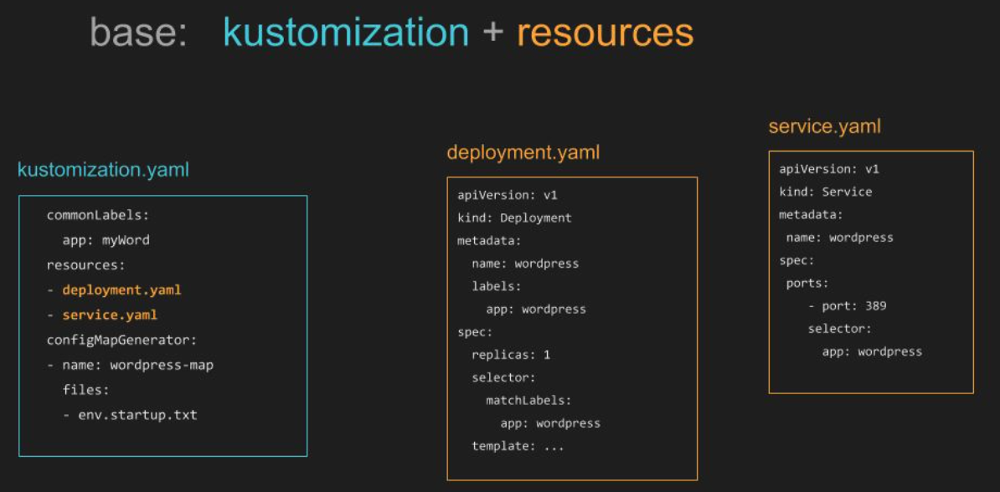
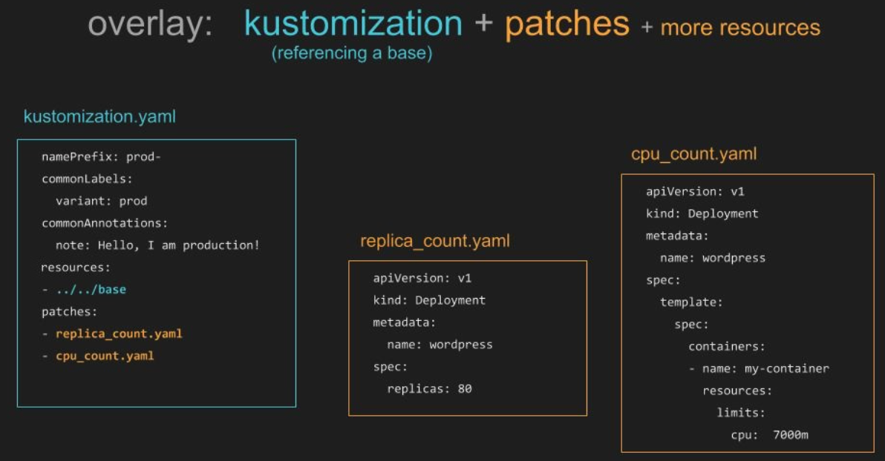

# ee-kubernetes-kustomize-framework
This repository provides a framework for using **Kustomize** - k8s config transformation tool, that allows you customize the YAML files without touching the original file(s).
To know more about Kustomize, please [click here](https://kustomize.io/).

## kustomize architecture

Kustomize has the concept of **bases** and **overlays**.

Base : It specifies the most common resources. A base is a directory with a **kustomization.yaml** and collection of kubernetes resources that should be part of every deployment.

Overlays : Always based on one more **bases**, that specifies use-case specific resources. An overlay is a directory with a **kustomization.yaml** that refers to other kustomization directories as its bases, plus any overwritten instruction(s) on the top of base resources.

